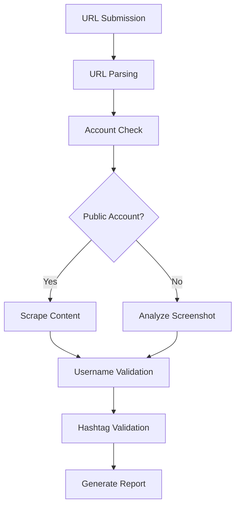

# Instagram Marketing Campaign Validator

<div align="center">


A robust FastAPI application for validating Instagram content submissions for marketing campaigns.

[Features](#-features) • [Quick Start](#-quick-start) • [API Usage](#-api-usage) • [Configuration](#-configuration) • [Deployment](#-deployment)

</div>

---

## 🚀 Features

| Feature | Description |
|---------|-------------|
| 📝 **Content Submission** | Submit Instagram posts, stories, or reels for validation |
| 🤖 **Automated Validation** | Extract usernames and hashtags using scraping or AI analysis |
| 🔍 **Account Visibility** | Detect public vs private Instagram accounts |
| #️⃣ **Hashtag Compliance** | Verify required campaign hashtags are present |
| 👨‍💼 **Admin Panel** | Secure admin interface for managing submissions |
| ⚡ **Real-time Status** | Track validation progress and results |

---

## 🏃‍♂️ Quick Start

### 1️⃣ Installation

```bash
# Clone the repository
git clone <repository-url>
cd instagram_validator

# Install dependencies
pip install -r requirements.txt
```

### 2️⃣ Configuration

```bash
# Copy environment template
cp .env.example .env

# Edit .env file with your settings
# Required: OPENAI_API_KEY
# Optional: Admin credentials, required hashtags
```

### 3️⃣ Run the Application

```bash
# Development mode
python run.py

# Or with uvicorn directly
uvicorn app.main:app --reload --host 0.0.0.0 --port 8000
```

### 4️⃣ Access the Application

| Service | URL | Description |
|---------|-----|-------------|
| 📚 **API Documentation** | http://localhost:8000/docs | Interactive API docs |
| 👨‍💼 **Admin Panel** | http://localhost:8000/admin | Management interface |
| ❤️ **Health Check** | http://localhost:8000/health | Service status |

---

## 📡 API Usage

### Submit Content for Validation

```bash
curl -X POST "http://localhost:8000/api/submit" \
  -F "instagram_url=https://www.instagram.com/p/ABC123/" \
  -F "content_type=post" \
  -F "screenshot=@screenshot.jpg"
```

### Check Submission Status

```bash
curl "http://localhost:8000/api/submission/1"
```

### Get Validation Statistics

```bash
curl "http://localhost:8000/api/stats"
```

---

## ⚙️ Configuration

### Environment Variables

| Variable | Description | Default | Required |
|----------|-------------|---------|----------|
| `OPENAI_API_KEY` | OpenAI API key for image analysis | - | ✅ |
| `ADMIN_USERNAME` | Admin panel username | `admin` | ❌ |
| `ADMIN_PASSWORD` | Admin panel password | `admin123` | ❌ |
| `ADMIN_SECRET_KEY` | JWT secret for admin auth | Random | ❌ |
| `REQUIRED_HASHTAGS` | Comma-separated required hashtags | `#MyBrand,#MyCampaign` | ❌ |
| `DATABASE_URL` | Database connection URL | `sqlite:///./instagram_validator.db` | ❌ |
| `DEBUG` | Enable debug mode | `False` | ❌ |

### Required Hashtags

Configure campaign hashtags in the `REQUIRED_HASHTAGS` environment variable:

```bash
REQUIRED_HASHTAGS=#MyBrand,#MyCampaign,#Contest2024
```

---

## 🔄 Validation Workflow



1. **URL Parsing**: Extract username from Instagram URL
2. **Account Check**: Determine if account is public or private
3. **Content Analysis**:
   - Public accounts: Scrape content directly using instaloader
   - Private accounts: Analyze screenshot using OpenAI GPT-4 Vision
4. **Username Validation**: Verify URL username matches content username
5. **Hashtag Validation**: Check for required campaign hashtags

---

## 👨‍💼 Admin Panel

Access the admin panel at `/admin` to:

- ✅ View all submissions and their status
- 🔍 Filter submissions by validation status
- 🔎 Search by username or URL
- 📊 View detailed validation results
- 📈 Monitor validation statistics

### Default Credentials

```
Username: admin
Password: admin123
```

> ⚠️ **Security Warning**: Change default credentials in production!

---

## 🗄️ Database Schema

### Submissions Table
- User-provided data (URL, content type, screenshot)
- Extracted data (usernames, hashtags)
- Validation results and status
- Timestamps and metadata

### Validation Results Table
- Detailed validation step results
- Extraction method and confidence
- Raw data for debugging

---

## 🛡️ Error Handling

The application gracefully handles various error scenarios:

| Error Type | Handling Strategy |
|------------|------------------|
| 🔗 **Invalid URLs** | Malformed or non-Instagram URLs |
| 🔒 **Private Accounts** | Falls back to screenshot analysis |
| 🕷️ **Scraping Failures** | Automatic fallback to AI analysis |
| 📁 **File Validation** | Size and type restrictions |
| 🌐 **API Failures** | Graceful degradation with error messages |

---

## 🛠️ Development

### Project Structure

```
instagram_validator/
├── 📁 app/
│   ├── 🐍 main.py              # FastAPI application
│   ├── ⚙️ config.py            # Configuration management
│   ├── 🗄️ database.py          # Database setup
│   ├── 📁 models/              # Data models
│   ├── 📁 services/            # Business logic
│   ├── 📁 api/                 # API endpoints
│   └── 📁 utils/               # Utilities
├── 📄 requirements.txt
├── 📄 .env.example
└── 🐍 run.py
```

### Adding New Features

| Component | Location | Purpose |
|-----------|----------|---------|
| **Validation Rules** | `services/ValidationService` | Extend validation logic |
| **Data Sources** | `services/` | Create new data extraction services |
| **API Endpoints** | `api/endpoints.py` | Add new API routes |
| **Admin Views** | `api/admin.py` | Extend admin functionality |

---

## 🚀 Deployment

### Production Security Checklist

- [ ] Change default admin credentials
- [ ] Use strong JWT secret key
- [ ] Configure CORS for your domain
- [ ] Use PostgreSQL instead of SQLite
- [ ] Enable HTTPS
- [ ] Set up proper logging
- [ ] Configure rate limiting

### Docker Deployment

```dockerfile
FROM python:3.11-slim

WORKDIR /app
COPY requirements.txt .
RUN pip install -r requirements.txt

COPY . .
CMD ["uvicorn", "app.main:app", "--host", "0.0.0.0", "--port", "8000"]
```

### Docker Compose

```yaml
version: '3.8'
services:
  app:
    build: .
    ports:
      - "8000:8000"
    environment:
      - DATABASE_URL=postgresql://user:password@db:5432/instagram_validator
    depends_on:
      - db
  
  db:
    image: postgres:15
    environment:
      POSTGRES_DB: instagram_validator
      POSTGRES_USER: user
      POSTGRES_PASSWORD: password
    volumes:
      - postgres_data:/var/lib/postgresql/data

volumes:
  postgres_data:
```

---

## 📞 Support

For issues and questions:

- 📖 Check the [API Documentation](http://localhost:8000/docs)
- 🐛 Report bugs in the Issues section
- 💬 Join our community discussions

---

<div align="center">

**Made with ❤️ using FastAPI**

</div>